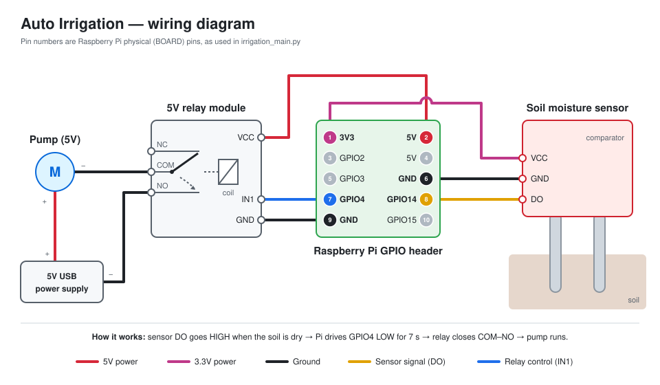

# Auto Irrigation System

  Raspberry pi powered auto irrigation system helps watering the plants automatically when the soil moisture drops below a certain level. Raspberry pi with the help of a soit moisture sensor reads the moisture level and starts the motor pump.
  
# Components
## Hardware

1. [Raspberry Pi](https://www.amazon.com/CanaKit-Raspberry-Power-Supply-Listed/dp/B07BC6WH7V/ref=sr_1_8?dchild=1&keywords=rpi+3&qid=1605555879&s=electronics&sr=1-8)
2. [Submersible pump 5V](https://www.amazon.com/gp/product/B07BHD6KXS/ref=ppx_yo_dt_b_asin_title_o00_s00?ie=UTF8&psc=1)
3. [5V Relay](https://www.amazon.com/gp/product/B0057OC5O8/ref=ppx_yo_dt_b_asin_title_o00_s00?ie=UTF8&psc=1)
4. [Soil moisture sensor](https://www.amazon.com/gp/product/B00ZR3B60I/ref=ppx_yo_dt_b_asin_title_o00_s00?ie=UTF8&psc=1)
5. [Water piping](https://www.lowes.com/pd/EZ-FLO-5-16-in-Inner-Diameter-x-20-ft-PVC-Clear-Vinyl-Tubing/1000365029)
6. Power supply 5V for pump - Convert any USB cables with USB power supply. Lot of tutorials available in the internet like [youtube video](https://www.youtube.com/watch?v=j2HFww2PGdQ). Wires in USB cable is very thin so I soldered with some basic wires. 

## Software

Programming language used is Python.
Mysql to store the watering history. 
Twilio APIs to send text message when the plant is watered. 

## Tools

1. Soldering Iron kit
2. [Dupont wires](https://www.amazon.com/gp/product/B01EV70C78/ref=ppx_yo_dt_b_asin_title_o00_s00?ie=UTF8&psc=1)
3. [Primary wire](https://www.amazon.com/American-Aluminum-Primary-Amplifier-Available/dp/B07D73ZRDP/ref=sr_1_16?dchild=1&keywords=primary+wire&qid=1605556801&sr=8-16)
4. [Wire stripper](https://www.amazon.com/Mr-Stripper-Stripping-Crimping-Electrical/dp/B086V5M1B4/ref=sr_1_23?dchild=1&keywords=wire+stripper&qid=1605556844&sr=8-23)
5. [Electrical tapes](https://www.amazon.com/Scotch-Super-Vinyl-Electrical-Tape/dp/B00004WCCL/ref=sr_1_3?dchild=1&keywords=electrical+tape&qid=1605556901&sr=8-3)
6. [Voltmeter](https://www.amazon.com/WeePro-Vpro850L-Multimeter-Voltmeter-Continuity/dp/B07VHC1NMC/ref=sxin_10_ac_d_pm?ac_md=1-0-VW5kZXIgJDI1-ac_d_pm&crid=3JGQ8UABZGDLU&cv_ct_cx=multimeter&dchild=1&keywords=multimeter&pd_rd_i=B07VHC1NMC&pd_rd_r=19be1095-9852-4053-98d5-1a075bef352f&pd_rd_w=u3Lzj&pd_rd_wg=b6vV5&pf_rd_p=68f25c26-6854-442e-9296-f746545e76bb&pf_rd_r=27FXN73QEVYQ6N116ZW5&psc=1&qid=1605557028&sprefix=multi%2Caps%2C211&sr=1-1-22d05c05-1231-4126-b7c4-3e7a9c0027d0) (Optional) to check the powersupply voltage.

# Wiring

Wires attached to moisture sensor, pump, USB power supply are all very thin so please be careful while stripping the wires. Solder the thin wires with the primary wire to make the edges thick. Use Red wire for +ve and black wires for -ve power supply wherever required. 

USB power supply: Take any unused USB cable or get one from local thrift stores. We only need the male end of the cable ( USB A end ) and cut the wire. Strip the wire to see the thin wires underneath. Red (+) and black(-) wires are power supply. White and Green wires are for data. Wires are very thin so solder the red and black wires to a primary wire so that it will be easy to use. 

I followed the same wiring setup in this [website](https://www.hackster.io/ben-eagan/raspberry-pi-automated-plant-watering-with-website-8af2dc)

All pin numbers are the Raspberry Pi's **physical (BOARD) pin numbers**, which is what `irrigation_main.py` uses (`GPIO.setmode(GPIO.BOARD)`).

| From | To (Raspberry Pi) | Wire |
|------|-------------------|------|
| Soil moisture sensor VCC | Pin 1 (3.3V) | Magenta |
| Soil moisture sensor GND | Pin 6 (GND) | Black |
| Soil moisture sensor DO (signal) | Pin 8 (GPIO14) | Yellow |
| Relay VCC | Pin 2 (5V) | Red |
| Relay IN1 | Pin 7 (GPIO4) | Blue |
| Relay GND | Pin 9 (GND) | Black |

> **Power the sensor from 3.3V, not 5V.** The Pi's GPIO pins only handle 3.3V. If the sensor board runs on 5V, its DO signal goes out at 5V and can damage pin 8 over time. Most soil moisture boards (LM393 comparator) work fine on 3.3V.

Pump - Connect the pump's + lead to the + of the 5V USB power supply. Run the pump's − lead to **COM** on relay 1, and the power supply's − to **NO** on relay 1. When the Pi pulls pin 7 LOW, the relay closes COM–NO and the pump runs. The program keeps it on for 7 seconds.

A [Fritzing breadboard view](static/img/wiring.png) of the same setup is also available.

# Coding

## irrigation_main.py

File contains the program to read the moisture sensor values, start and stop the pump, store the logs and send text message if watered. 

## Scheduling

I used linux crontab to schedule this program. scheduled to execute the irrigation_main.py for every 4 hours. Choose a schedule suits your needs. 

0 */4 * * * /usr/bin/python3 /home/pi/Documents/irigation_system/irrigation_main.py

References: https://www.hackster.io/ben-eagan/raspberry-pi-automated-plant-watering-with-website-8af2dc
            https://medium.com/going-fullstack/watering-plants-with-a-raspberry-pi-36eac51b8d23
            

